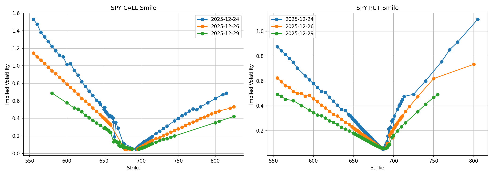
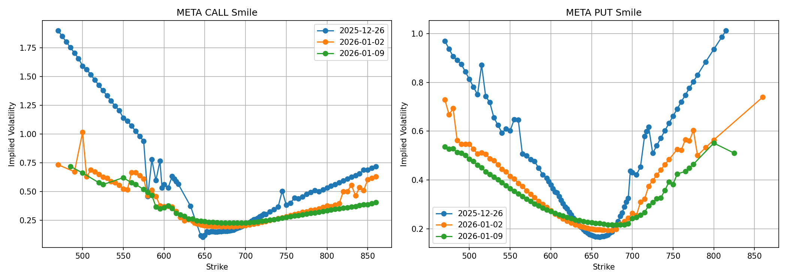
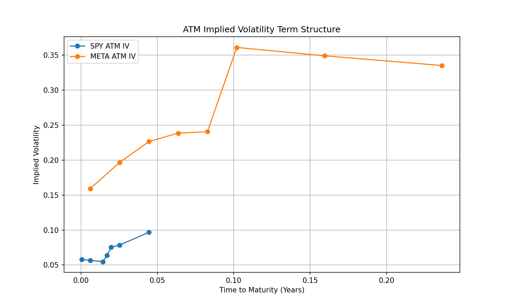
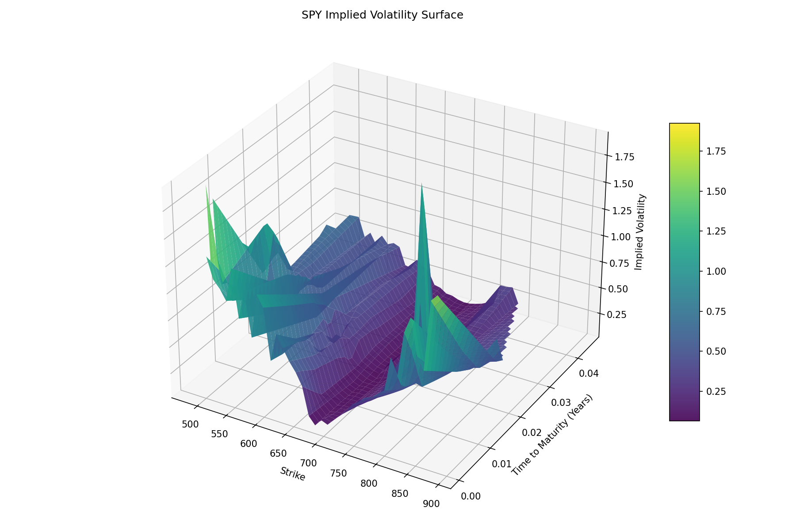
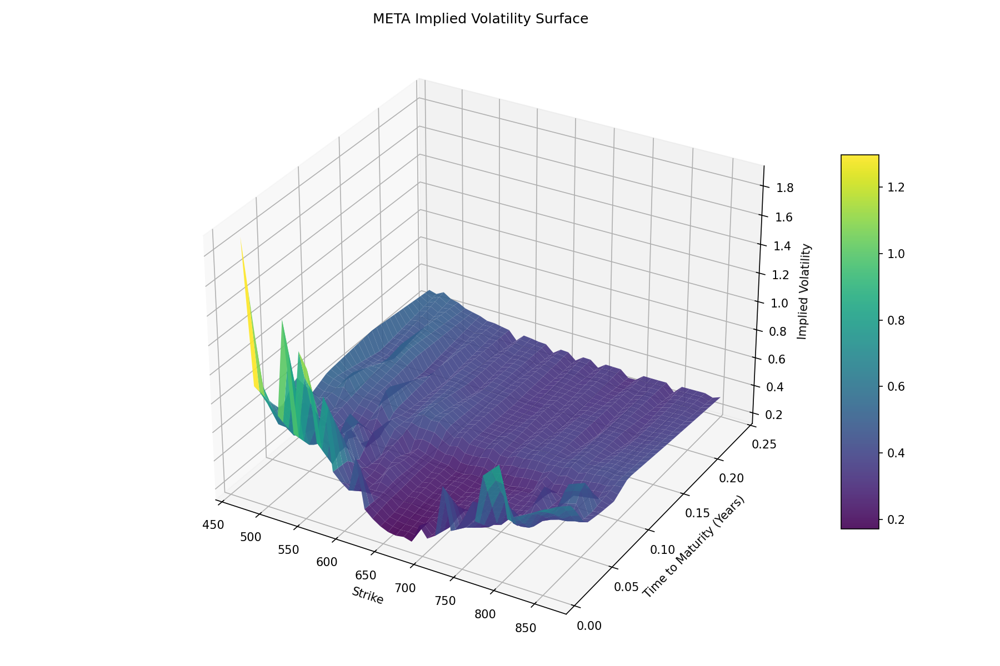

# Volatility & Options Surface Builder

This project builds and visualizes implied volatility surfaces using live equity options data.  
It replicates core workflows used on derivatives desks and in quant-adjacent research roles.

The analysis compares an index ETF (**SPY**) with a single stock (**META**) to highlight differences in
volatility smile, skew, term structure, and earnings-driven risk premia.

---

## 📌 Key Concepts Demonstrated

- Implied volatility smiles and skew
- Call vs put asymmetry
- ATM volatility term structure
- 3D volatility surface construction
- Live options data ingestion
- Black–Scholes Greeks

---

## 📂 Project Structure

---

## 📊 Volatility Smiles (Calls vs Puts)

### SPY

- Mild downside skew
- Relatively flat smile
- Reflects diversified index risk

### META

- Steeper downside skew
- Higher front-end implied volatility
- Reflects idiosyncratic and earnings-related risk

---

## ⏱ ATM Implied Volatility Term Structure

- SPY exhibits a smooth, macro-driven term structure
- META shows an elevated front-end volatility hump driven by earnings uncertainty

---

## 🌐 3D Implied Volatility Surfaces

### SPY Surface

- Smooth surface
- Mild curvature across strikes and maturities

### META Surface

- Strong downside skew
- Elevated short-dated volatility
- Clear earnings-driven structure

---

## ⚙️ Methodology Notes

- Option chains sourced from Yahoo Finance
- Mid prices constructed using bid–ask midpoint (fallback to last price)
- Implied volatility taken from exchange-provided IV for robustness
- Black–Scholes Greeks computed analytically
- Light filtering applied to remove illiquid and arbitrage-violating quotes
- Surfaces interpolated using linear grid interpolation

---

## 🧠 Key Takeaways

- Index volatility is smoother and macro-driven
- Single stocks embed significant idiosyncratic and earnings risk
- Volatility surfaces jointly capture smile, skew, and term structure effects
- Raw option data requires careful filtering before surface construction

---

## 🚀 Possible Extensions

- Historical volatility surface evolution
- Calendar vs diagonal spread analysis
- No-arbitrage smoothing constraints
- Alternative models (SABR, local volatility)
- Earnings event tagging

---

## 📎 Author

Built as a quantitative finance portfolio project to demonstrate derivatives modeling,
market intuition, and data-driven visualization.

